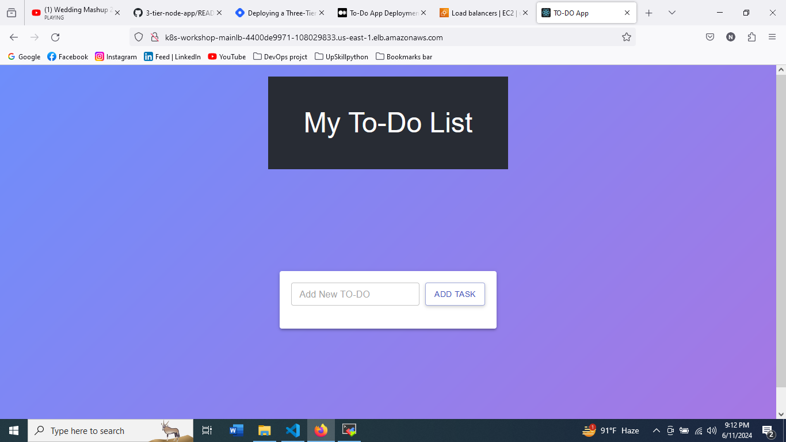

# Three-Tier Web Application Deployment on AWS EKS using AWS EKS, ArgoCD, Prometheus, Grafana, and Jenkins


Welcome to the Three-Tier Web Application Deployment project! 🚀

This repository hosts the implementation of a Three-Tier Web App using ReactJS, NodeJS, and MongoDB, deployed on AWS EKS. The project covers a wide range of tools and practices for a robust and scalable DevOps setup.

## Project Details
🛠️ **Tools Explored:**
- Terraform & AWS CLI for AWS infrastructure
- Jenkins Inage update
- Helm for install load balancer
- ArgoCD for GitOps practices

### Step 1: IAM Configuration
- create IAM user `user` with administration access.
- Generate Security Credentials: Access Key and Secret Access Key.

### Step 2: EC2 Setup using terraform
- Run the following commands. 
``` shell 
terraform init
terraform validate 
terraform plan --var-file=variables.tfvars
terraform apply --var-file=variables.tfvars --auto-approve
terraform destroy --auto-approve
```
- after all work done infrastructure should be destroy: `terraform destroy`
- SSH into the instance from your local machine.


### Step 3: check every tools install successfully

```shell
jenkins --version
docker --version
aws version
kubectl version --client --short
```

### Step 4: clone repo
```shell
git clone https://github.com/nusratdevo/3tier-todo-app.git
cd 3tier-todo-app
```
### Step : We need to create Amazon ECR for both Tiers (Frontend & Backend)
- Go to aws console and lookup for ECR
- click on “Create Repository” for frontend and set visibility settings to public
- 


- select one ECR repo and click view push command 
- Goto Application-Code directory  run ```cd backend``` then run these command one by one to create backend image
- 


- Again run ```cd frontend``` then run these command one by one to create frontend image


### Step: Create an eks cluster
- EKS cluster can be set up using below commands on base EC2 instance:
``` shell
eksctl create cluster --name three-tier-cluster --region us-east-1 --node-type t2.medium --nodes-min 2 --nodes-max 2
```
- It may take 20min to configure EKS cluster, so be patient and watch out for any events/errors.
- update kubeconfig with interaction kubectl
``` shell 
aws eks update-kubeconfig --region us-east-1 --name three-tier-cluster
kubectl get nodes
```
- Creating “Namespace” for application deployment under this namespace
```shell
kubectl create namespace workshop
kubectl config set-context --current --namespace workshop
```
### Step : Configure a Load Balancer on our EKS because our application will have an ingress controller.
- we need to Create the IAM policy, Create the IAM policy and  a Service Account to attach our cluster and load balancer
``` shell
curl -O https://raw.githubusercontent.com/kubernetes-sigs/aws-load-balancer-controller/v2.5.4/docs/install/iam_policy.json
aws iam create-policy --policy-name AWSLoadBalancerControllerIAMPolicy --policy-document file://iam_policy.json
eksctl utils associate-iam-oidc-provider --region=us-east-1 --cluster=three-tier-cluster --approve
eksctl create iamserviceaccount --cluster=three-tier-cluster --namespace=kube-system --name=aws-load-balancer-controller --role-name AmazonEKSLoadBalancerControllerRole --attach-policy-arn=arn:aws:iam::<AWS ACCOUNT_NUMBER>:policy/AWSLoadBalancerControllerIAMPolicy --approve --region=us-east-1
```
- We need to deploy the Load Balancer using helm
``` shell
sudo snap install helm --classic
helm repo add eks https://aws.github.io/eks-charts
helm repo update eks
```
- Install and configure load balancer
```shell 
helm install aws-load-balancer-controller eks/aws-load-balancer-controller -n kube-system --set clusterName=my-cluster --set serviceAccount.create=false --set serviceAccount.name=aws-load-balancer-controller
```
- wait for few minite to install load balancer, then run the command below to check whether your pods are running or not.
``` kubectl get deployment -n kube-system aws-load-balancer-controller ```

### Step: Creating Deployment and Services for frontend and backend
- goto Kubernetes-Manifests-file directory ``` cd Kubernetes-Manifests-file/backend```
- change image url by which we create on ecr
- now we ready to deploy backend app
``` shell
kubectl apply -f backend-deployment.yaml
kubectl apply -f backend-service.yaml
kubectl get pods -n workshop
```
- we need to change frontend image too and run bellow command
``` shell
kubectl apply -f frontend-deployment.yaml
kubectl apply -f frontend-service.yaml
```
- Goto Database directory and deployment the apps
```shell
cd Database
kubectl apply -f .
kubectl get all
```
- Now setup ingress for internal routing and deploy Ingress controller
```shell
kubectl apply -f ingress.yaml
kubectl get ing -n workshop
```
- The resulted DNS name will fetch the application deployment results. Copy and paste the DNS name to browser to check your application status using three-tier deployment method.



### Step: Final Steps: Clean UP
- In current Kubernets-Manifests-file directory delete deployments using below CMD
  ``` kubectl delete -f .```

- Switch to Frontend folder to delete Frontend Tier
```kubectl delete -f .```

- Switch to DAtabase folder to delete Database Tier
```kubectl delete -f .```

- Clean up the AWS EKS Cluster from the stack of your cloud formation.
```shell
eksctl delete cluster --name three-tier-cluster --region us-east-1
aws cloudformation delete-stack --stack-name eksctl-three-tier-cluster-cluster
```
- Delete Roles created during eks cluster creation
- finally delete ec2 instance by using terraform command
``` shell
terraform destroy --var-file=variables.tfvars --auto-approve
```
